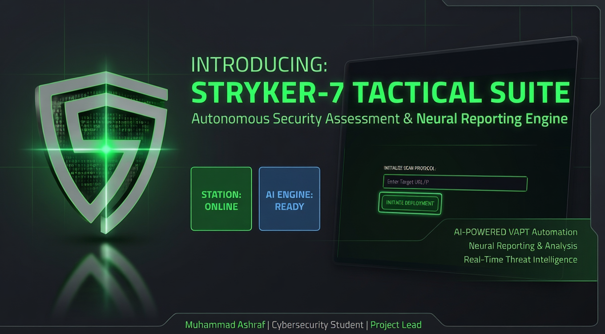
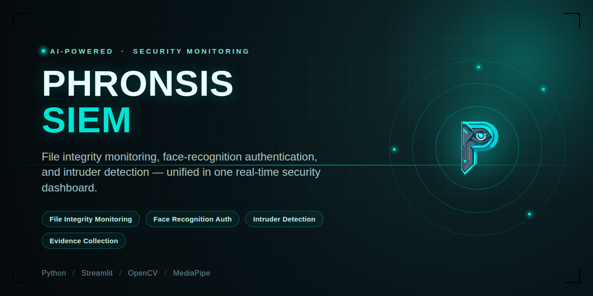
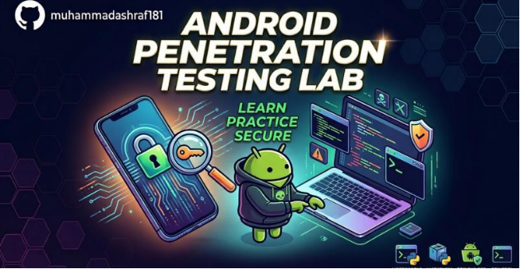

  
  
  
  

---

### 

- **Education** — Pursuing **BS in Digital Forensics & Cyber Security** at Hamdard University, KDA Campus, Karachi (5th Semester)
- **Current Role** — **Red Team Intern** at **Cyberster**, performing hands-on security assessments and penetration testing in simulated environments
- **Focus** — Bridging **Red Team** (offensive) and **Blue Team** (defensive) security — from exploitation and reconnaissance to digital forensics and threat hunting
- **Building** — Security tooling including **STRYKER-7** (automated VAPT engine) and **Phronsis** (AI-powered SIEM)
- **Certifications** — Working toward **CEH**; completed the **Blue Team Junior Analyst (BTJA)** pathway

---

### 

**Offensive Security**

**Defensive Security**

**Languages & Platforms**

  

  
  

---

### 

<table>
  <tr>
    <td width="50%">
      
      
<b>STRYKER-7 Tactical Suite</b> AI-powered VAPT automation framework integrating 7 tools with real-time, human-readable vulnerability insights and mitigation guidance.

    </td>
    <td width="50%">
      
      
<b>Phronsis – AI SIEM Engine</b> Automated threat detection platform with file integrity monitoring, event graph analytics, and OpenCV-based access control.

    </td>
  </tr>
  <tr>
    <td width="50%">
      
      
<b>SafeEd – Secure Record System</b> Console-based student record system with SHA-256 credential hashing, RBAC, and security activity logging.

    </td>
    <td width="50%">
      
      
<b>Android Security Assessment</b> Vulnerability assessment on an Android application using structured threat analysis methodology.

    </td>
  </tr>
</table>

> **Note:** I don't have your real repo URLs, so I've guessed slugs (`STRYKER-7`, `Phronsis-SIEM`, `SafeEd`, `Android-Security-Assessment`) based on project names — replace `href` values above with your actual repo links once you confirm them, or the images will link to 404 pages.

---

### 

  

---

### 

  
  
  

<i>Red Team / Blue Team practitioner — building tools, breaking systems (legally), and documenting it all.</i>

